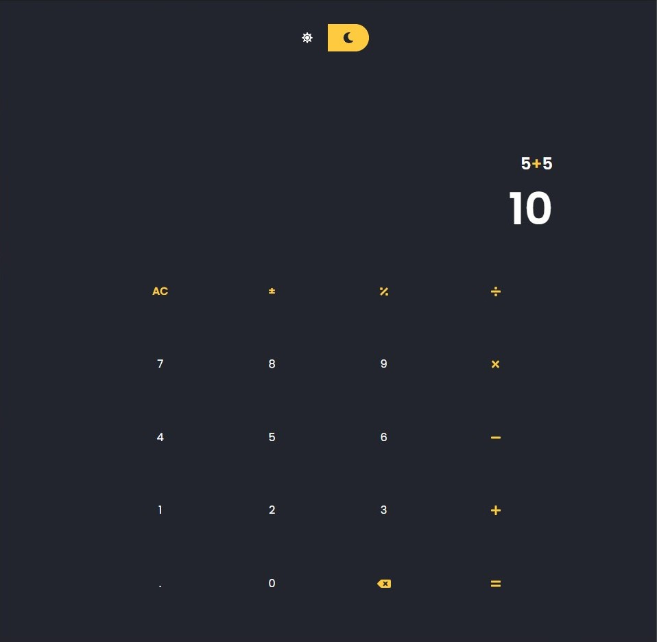
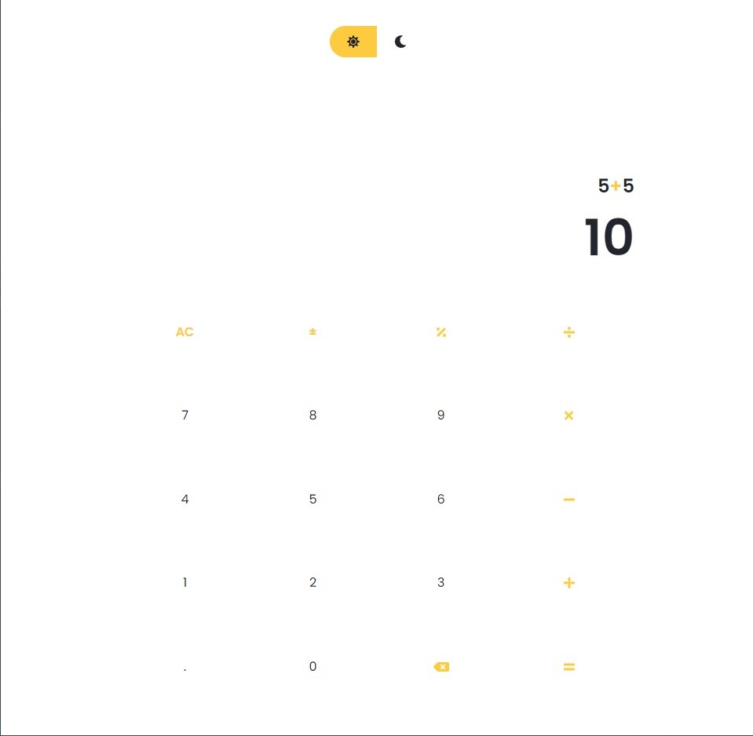

## Bugged Calculator

### Introduction

This's my first calculator made using react. And a the title suggests, it contains some bugs that i chose to turn into features :)

## Project Screen Shot(s)

#### Example:

## Installation and Setup Instructions

#### Example:

Clone down this repository. You will need `node` and `npm` installed globally on your machine.

Installation:

`npm install`

To Run Test Suite:

`npm test`

To Start Server:

`npm start`

To Visit App:

`localhost:3000`

## Reflection

This was a quick project built during my free time learning react. Project goals were simply build a simple calculator using react, bootstrap and sass.

Originaly i wanted the application to encompass multiple advanced maths calculations. But my busy schedule forced me to cut down on my expectations.

One of the main challenges I ran into was the actual calculation process. Which took me some time to figure out without using the internet to find an easy solution. 

At the end of the day, The tech used in this project are react, sass and bootstrap.